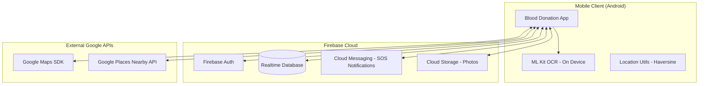

# 🩸 Blood Donation Finder — Advanced Android Application

**Version:** 3.5 | **Language:** Java | **Architecture:** MVC | **Environment:** Android Studio Flamingo+
**Developed By:** Anuj Partani & Aditi Thakre

---

## 📋 Comprehensive Project Overview

The **Blood Donation Finder** is a state-of-the-art real-time Android application designed to bridge the gap between blood donors and those in urgent medical need. Unlike standard donation apps, this project integrates **Machine Learning (OCR)**, **Real-time Geolocation**, and **Gamified User Engagement** to create a highly efficient life-saving ecosystem.

### The "Meaning" Behind the Innovations
This app isn't just a database; it’s a proactive response system. By using **ML Kit**, we reduce the time taken to post a request. By using **Smart Compatibility**, we widen the search net. By using **Gamification**, we encourage long-term donor retention.

---

## 🌟 Advanced Innovation Features (The "Wow" Factor)

### 📸 1. ML-Powered Prescription Scanning (OCR)
- **Understanding:** Users often make mistakes when typing medical terms or blood groups. We use **Google ML Kit Text Recognition** to scan physical hospital prescriptions.
- **Meaning:** The app automatically extracts the Blood Group, Hospital Name, and Urgency from a photo, ensuring data accuracy and saving precious seconds during emergencies.

### 🔒 2. Privacy-First Secure In-App Chat
- **Understanding:** To protect privacy, users shouldn't have to share their phone numbers publicly. We built a real-time messaging system using Firebase.
- **Meaning:** A sorted `chatId` logic (`uid1_uid2`) ensures a unique, permanent private channel between any two users, encrypted at rest within the Firebase database.

### 🔬 3. Smart Blood Compatibility Logic
- **Understanding:** Not only an exact match can save a life (e.g., O- can donate to anyone). We encoded the **WHO ABO/Rh compatibility matrix** into the Java logic.
- **Meaning:** When a user searches for blood, they can toggle "Smart Match" to find every donor type that is biologically compatible, significantly increasing the chances of finding a donor.

### 🆘 4. One-Tap SOS Emergency Broadcast
- **Understanding:** In critical situations, searching manually is too slow. The SOS button triggers a **Critical Priority Broadcast**.
- **Meaning:** It simultaneously creates a database entry, fires a high-priority push notification to all nearby donors, and triggers a physical haptic vibration alert on devices.

### 🏥 5. Google Places: Nearby Blood Banks
- **Understanding:** If a personal donor isn't available, the next best option is a professional facility.
- **Meaning:** Using the **Google Places API**, the map dynamically fetches and marks real-world blood banks and hospitals within a 5km radius of the user's live location.

### 🏅 6. Gamified Donor Loyalty System
- **Understanding:** Consistent donation is key. We implemented a badge system (`Rookie` to `Diamond Saver`).
- **Meaning:** Donors earn 50 "Loyalty Points" per donation. This psychological reward system encourages users to return, turning a one-time act into a life-long habit.

---

## 🏛️ System Architecture

The following diagram illustrates the high-level interaction between the mobile client, the cloud backend, and external AI/Geo services.



### Data Flow for SOS Broadcast
1. **User** taps SOS button in **App**.
2. **App** gets current GPS via **FusedLocation**.
3. **App** writes high-priority record to **Firebase Database**.
4. **Firebase Cloud Function/Service** triggers **FCM**.
5. **Nearby Donors** receive a high-priority push notification.

---

## 🛠️ Technical Implementation Details

### Core Technologies
- **Backend:** Firebase Realtime Database (for 0.5s latency data sync).
- **Authentication:** Firebase Auth (Secure Email/Password & UID management).
- **Images:** Firebase Storage + Glide (Caching and circular image processing).
- **Animations:** Lottie (For high-quality, lightweight UI micro-interactions).

### Mathematical Logic
- **Haversine Formula:** Used in `LocationUtils.java` to calculate the exact distance between two coordinates on a sphere (Earth), enabling the radius-based donor search (5km, 10km, etc.).
- **Eligibility Logic:** The app prevents donors from being searched if their last donation was less than **56 days** ago, following medical safety standards.

---

## 📁 Project Architecture

```
BloodDonationFinder/
├── app/
│   ├── src/main/
│   │   ├── java/com/blooddonation/finder/
│   │   │   ├── activities/    (UI Logic: Search, Map, Chat, SOS, Profile)
│   │   │   ├── adapters/      (Data Binding: Recycler views for chat & results)
│   │   │   ├── models/        (Data structures: Donor, BloodRequest, ChatMessage)
│   │   │   └── utils/         (Engine Room: Distance math, Locale, OCR logic)
│   │   ├── res/
│   │   │   ├── layout/        (XML screen layouts)
│   │   │   ├── values/        (Strings, Colors, Themes)
│   │   │   └── values-hi/     (Hindi Localization)
│   │   └── AndroidManifest.xml
│   └── build.gradle
└── README.md
```

---

## 🏆 Donor Badge Progression

| Badge | Donations | Points | Meaning |
|---|---|---|---|
| 🔰 Rookie | 0 | 0 | Just signed up to save lives. |
| 🥉 Bronze Helper | 1+ | 50+ | First successful life saved. |
| 🥈 Silver Lifeline | 3+ | 150+ | A consistent lifeline. |
| 🥇 Gold Donor | 5+ | 250+ | Respected community hero. |
| 💎 Diamond Saver | 10+ | 500+ | Elite life-saver status. |

---

## ⚠️ Important Configuration Notes

- **google-services.json:** Must be placed in `/app` directory.
- **Places API:** Must be enabled in Google Cloud Console for "Nearby Blood Banks" to work.
- **Map Legend:** 🔴 Available Donors | 🔵 Busy Donors | 🟣 Public Blood Banks.

---

*Blood Donation Finder © 2026 | Anuj Partani & Aditi Thakre*  
*Empowering individuals to save lives through technology.*
